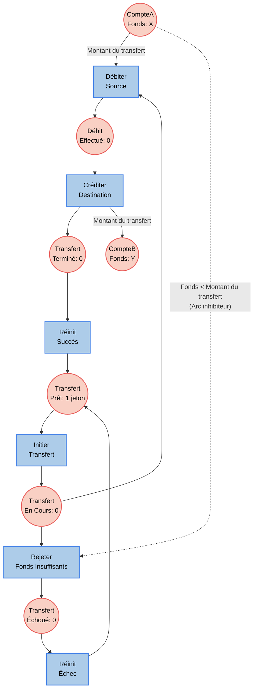

# Schéma Visuel du Réseau de Pétri - Système de Paiement Distribué

Ce document modélise visuellement le réseau de Pétri de notre système de paiement distribué (implémenté avec Akka). Il est généré avec Mermaid.js et peut être rendu directement sur GitHub, Notion ou d'autres éditeurs Markdown. 

Cette version représente la logique du projet avec des paramètres généralisés : le nombre de jetons sur les comptes ("Fonds: X" et "Fonds: Y") et le montant de la transaction de manière dynamique.

Les places (en rouge/rond) représentent les états ou ressources.
Les transitions (en bleu/rectangle) représentent les actions franchissables.

## Description des Règles
- **InitierTransfert** consomme le jeton "Transfert Prêt" et place un jeton dans "Transfert En Cours".
- **DébiterSource** nécessite d'avoir le "Montant du transfert" en jetons dans le "CompteA" et 1 jeton dans "Transfert En Cours" pour pouvoir exécuter le débit avec succès.
- **RejeterFondsInsuffisants** possède un *arc inhibiteur* vers le CompteA : cette transition est activée si et seulement s'il y a un transfert en cours MAIS un solde strictement inférieur au montant du transfert. Elle mène vers "Transfert Échoué".
- **CréditerDestination** transfère les fonds vers le "CompteB" (+ "Montant du transfert" en jetons) une fois le débit effectué et marque le transfert comme Terminé.
- Les transitions de **Réinit** (succès ou échec) permettent de rendre à nouveau le système disponible pour une nouvelle transaction (vivacité et absence de deadlock terminal).
